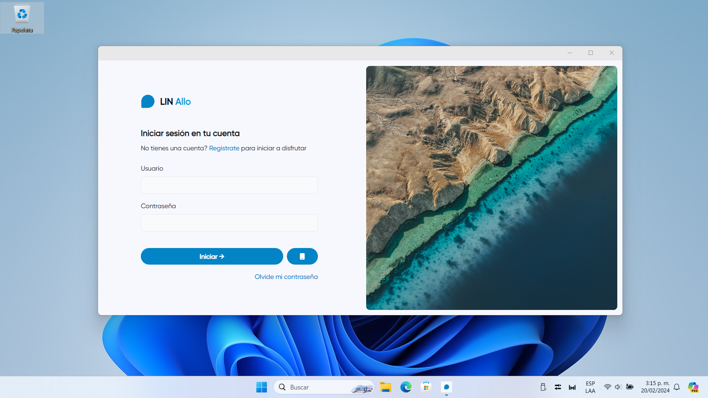
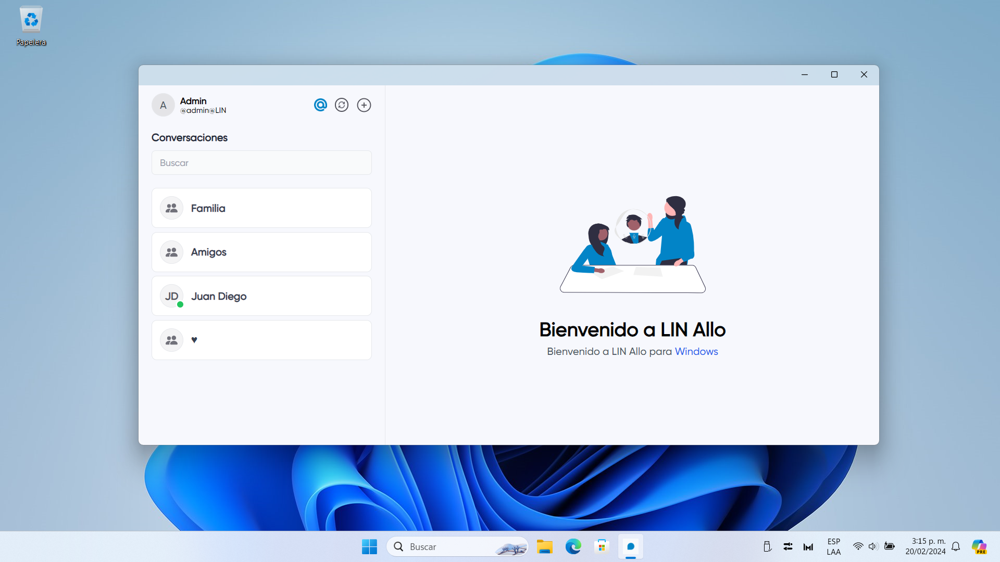
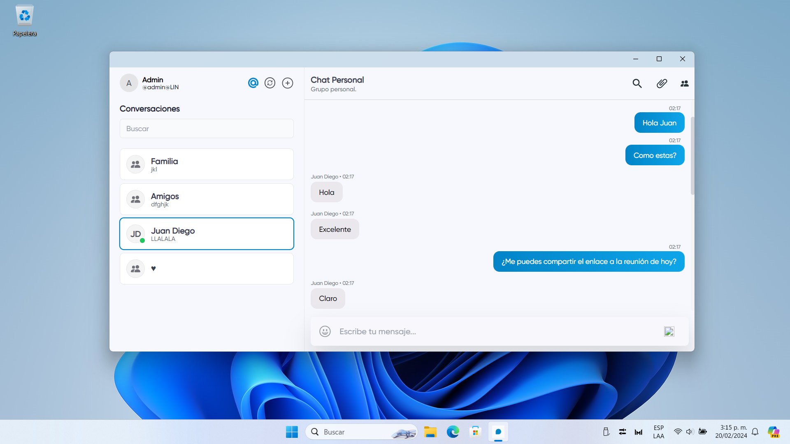

<div align="center">
  <p align="center">
    
  </p>
  <p>LIN Allo para Windows y Android es una bifurcación del proyecto LIN Allo Web.</p>
 <p align="center">
    
    
  </p>
</div>


```ROMA VERSION```


Cliente nativo construido en .NET Maui & Blazor Hybrid App.


## Características

- Multiplataforma (Android (APK) y Windows)
- Mensajes
- Grupos de personas
- Integrado con Emma Assistant







## ¿Que sigue?

* Enviar ubicación.
* Enviar imágenes.
* Mejoras de UI.