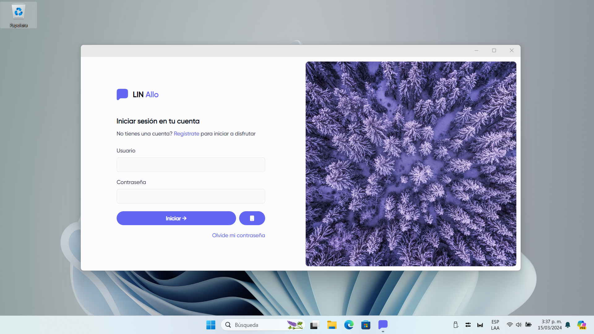
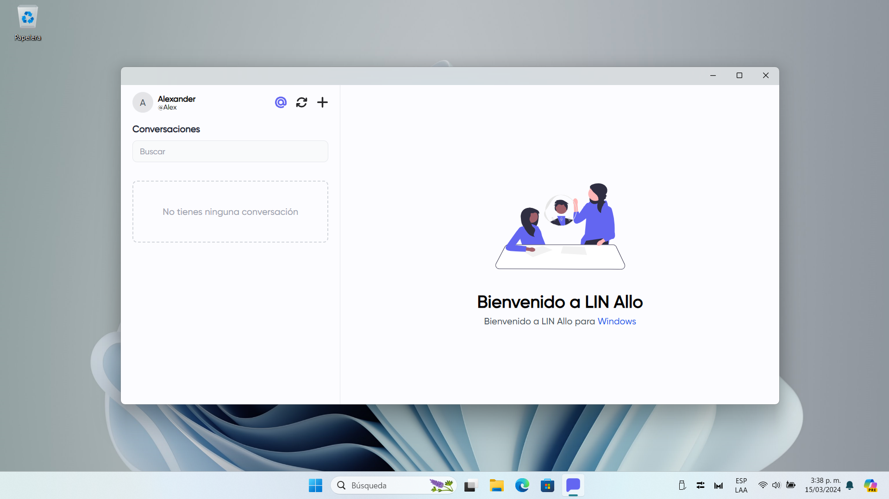

# LIN Allo App

LIN Allo para Windows y Android es una difurcación del proyecto LIN Allo Web.

Cliente nativo construido en .NET Maui & Blazor Hybrid App.

## Caracteristicas

- Multiplataforma (Android (APK) y Windows)
- Enviar imagenes
- Enviar ubicacion
- Mensajes
- Grupos de personas

