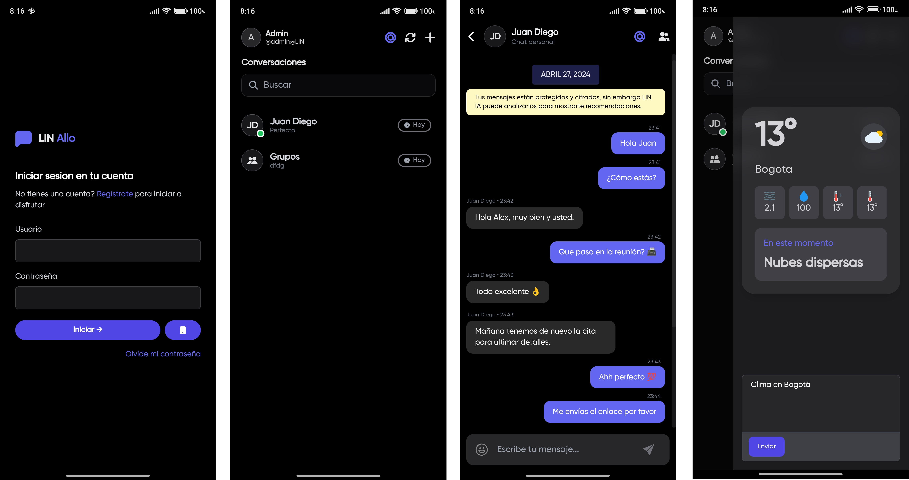

  

    
  

  
LIN Allo para Windows y Android es una bifurcación del proyecto LIN Allo Web.

 

    
    
  

Cliente nativo construido en .NET Maui & Blazor Hybrid App.

## Características

- Multiplataforma (Android (APK) y Windows)
- Mensajes
- Grupos de personas
- Integrado con Emma Assistant

## Emma Assistant
Allo integra **Emma** el asistente inteligente de LIN.

- Preguntar sobre el clima actual.
- Redactar y enviar mensajes.
- Abrir conversaciones.
- Información desde otras apps.

## Android

#### Modo claro

#### Modo oscuro

## Windows

## ¿Que sigue?

Actualmente se esta trabajando esto:

* Enviar ubicación.
* Enviar imágenes.
* Mejoras de UI .